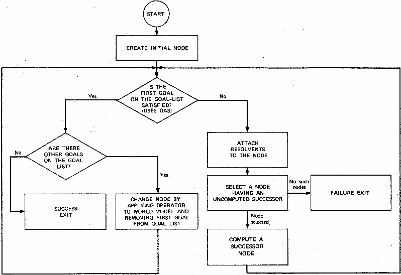
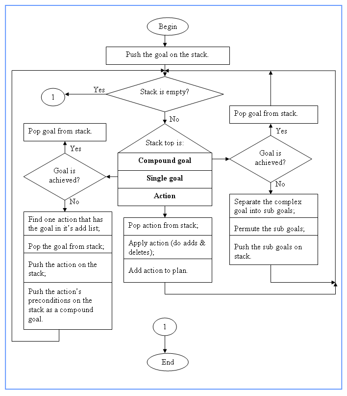
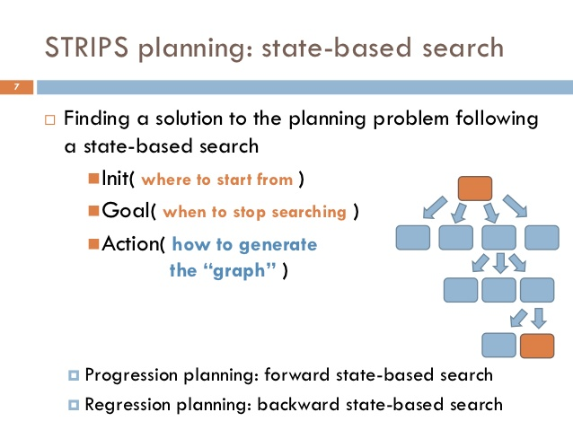
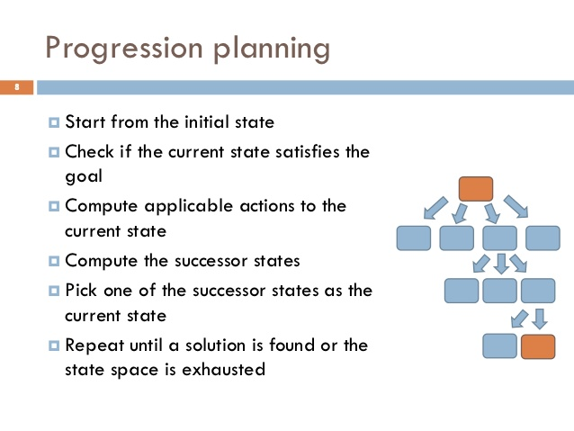
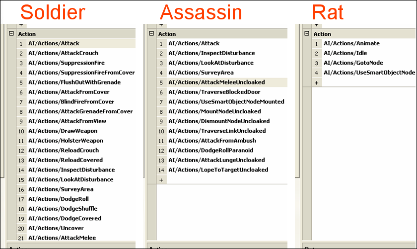
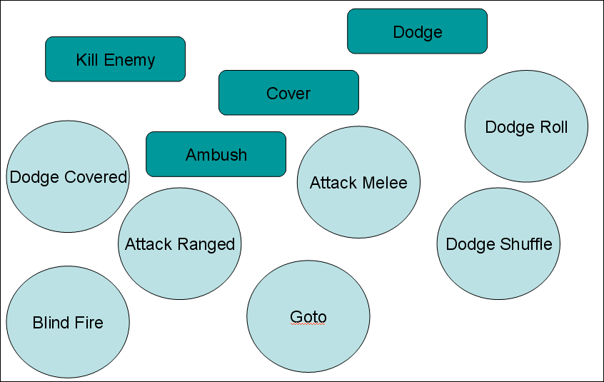

### STRIPS tehnika

STRIPS (Stanford Research Institute Problem Solver) je tehnika razvijena 1971. Despite being over a third of a century old, ova tehnika je prvi put primenjena u igri F.E.A.R. 2005. STRIPS instanca se sastoji od:

* An initial state;
* The goal states – situations which the planner is trying to reach;
* A set of actions. For each action, the following are included:
  * preconditions (what must be established before the action is performed);
  * postconditions (what is established after the action is performed).

The planner uses a strategy known as means-end. This works by looking at what needs to change in the world model, and selecting an appropriate operator to perform this task. For example, if the goal position is different then use a move-to operator.

The system uses dependency tracking to figure out preconditions for all the operators in a plan. When something unexpected happens, the system knows if replanning is necessary or not, and for which reason.

Tri različita objekta imaju različite akcije na raspolaganju da ostvare zadate ciljeve:

STRIPS samo zadaje stanja (slika levo), ali ne i putanje između njih, kao FSM (slika desno).

AI pokušava da ostvari svoj cilj na sve raspoložive načine, npr:
* A.I. try to open the door and fail.
* He then re-plans and decides to kick the door. When this fails, he re-plans again
* A.I. decides to dive through the window

This dynamic behavior arises out of re-planning while taking into account knowledge gained through previous failures.

An `action` is a C++ class that has the `preconditions` both represented as an array of world state variables, and as a function that can do additional filtering. An A.I. trying to escape danger will run away if he can find a path to safety, or hunker down in place if he can’t find anywhere to go. The run away action is preferable, but can only be used if the `CheckProceduralPreconditions()` function return `true`.
