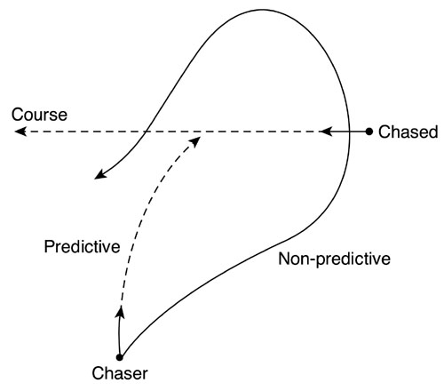

### Tracking

One of the first problems we must deal with in any action AI system is maintaining eye contact with a target. Eye contact can be formulated as, given an orientation and a point in space, computing the best rotation to align the orientation with the point.

### Chasing

After we know how to aim at a target, we have to implement a chase behavior. In its simplest form, chasing involves moving forward while keeping eye contact with the target. Thus, we will keep aligned with the target and advance toward it.

The source code for a constant-speed, 2D chaser:

```java
void chase(point myPos, float myYaw, point hisPos)
{
  reaim(myPos, myYaw, hisPos);
  myPos.x = myPos.x + cos(myYaw) * speed;
  myPos.z = myPos.z + sin(myYaw) * speed;
}
```

### Predictive Chasing

One alternative to ensure a better chase is to use predictive techniques. Here we will not aim at the target directly, but try to anticipate his movements. This idea is really straightforward. Keep track of the position history of the opponent and use that information to create a "predicted position" some time in the future.



Instead of aiming and advancing, we will use a three-step approach, which involves:
* Calculating a projected position
* Aiming at that position
* Advancing

```java
void chase(point myPos, float myYaw, point hisPos, point prevPos)
{
  point vec = hisPos - prevPos;      // vec is the 1-frame position difference
  vec = vec * N;                     // we project N frames into the future
  point futurePos = hisPos + vec;    // and build the future projection
  reaim(myPos, myYaw, futurePos);
  myPos.x = myPos.x + cos(myYaw) * speed;
  myPos.z = myPos.z + sin(myYaw) * speed;
}
```

### Evasion

Essentially, evading is the opposite of chasing. Instead of trying to decrease the distance to the target, we will try to maximize it. Thus, an evasion algorithm will be very similar to a chasing algorithm except for some sign changes:

```java
void evade(point myPos, float myYaw, point hisPos)
{
  reaim(myPos,myYaw,hisPos); negated
  myPos.x = myPos.x + cos(myYaw) * speed;
  myPos.z = myPos.z + sin(myYaw) * speed;
}
```

### Patrolling

Common behavior in any action AI system is patrolling. Soldiers, dogs, and many other game characters patrol a predefined area, usually engaging in combat when an enemy is discovered.

To implement a patrolling behavior, we have to store a set of waypoints that will determine the AI path. These waypoints can be followed in two configurations: cyclic and ping-pong. The easiest way to implement this is through a minimal, two-state finite-state machine. The first state is used to advance toward the next waypoint (represented internally by an integer). Then, as we approach closer to a predefined threshold, we move to the second state.

### Hiding and Taking Cover

Sometimes we will need our AIs to run for cover. Taking cover consists of two actions performed sequentially. First, a good hiding spot must be located in the game level. Second, we must move there quickly. This second phase is just a chase routine.

To detect good hiding spots, we will need three data items:
* The position and orientation of the player
* Our position and orientation
* The geometry of the level

The geometry of the level must be stored in such a way that it allows proximity queries on objects that can actually become hiding spots.

### Shooting

We need to learn when is it a good idea to shoot at the player. We also need to know whether we are handling a machine gun, a sniper rifle, or a catapult. As you will soon see, each one requires slightly different approaches to the problem of targeting.

The first approach we will explore is shooting with a weapon that has infinite speed, or in practical terms, very high speed compared to the speed of the target. This can be the case of a laser gun, which would advance at light speed. A real gun shoots projectiles at a limited speed (approximately 300-600 meters per second). This means shooting a fast moving target is harder than shooting one that stands still.

#### Version A: The Still Shooter

The still shooter only shoots when the enemy is standing still for a certain period of time. The reason is simple. If the bullet takes one second to hit the target, and the target has been standing still for a certain period of time, it is a good hypothesis to assume the target will stand still for another second.

#### Version B: The Tracker

Shooting a moving target is really hard. We need to combine the shooting behavior with a target tracking routine, and there is a predictive component going on as well.

The idea is simple: Compute the distance from the sniper to the target, use the projectile velocity to compute how long it will take to reach the target, and predict where the target will be when the projectile arrives.

#### Machine Guns

Machine guns offer fast firing rates at the cost of precision. Shots cause the cannon to shake, making it hard to aim accurately. Thus, their main use is not in targeting people, but areas.

The first type of machine gun is the fixed machine gun (gunners in bunkers, trenches, and so on). Some classic guns would be the MG-42 used by the German army in World War II. Here are some stats:

```
MG-42 (with lightweight tripod)
Firing rate: 25 rounds per second
Range: 1000 meters
Muzzle velocity: 820 meters per second
Weight: 11.6 Kg

MG-42 (with Lafette tripod)
Firing rate: 25 rounds per second
Range: 1000 meters
Muzzle velocity: 820 meters per second
Weight: 31.1 Kg
```

From these statistics, several lessons can be extracted. First, these guns hardly ever moved, but instead kept on targeting and shooting down enemies from a fixed position. Second, these guns did not have a lot of autonomy, the standard feed type for the MG-42 was a 50/250 metal belt. Thus, a burst could not last longer than 10 seconds, followed by a pause to change the metal belt.

Their algorithm is relatively straightforward. By default, the soldier stands still, waiting for new enemies to arrive. Then, as they begin to get closer, the gunner must rotate the gun to face the enemy. Rotation must somehow be penalized for slower models. Keep in mind each shot introduces some distortion to the aiming due to recoil, so the gunner must re-aim every time. As a result, fixed gunners do not usually aim carefully; they aim at an area.

A common mistake is to forget about feed sizes. Many World War II games display machine guns that seem to have infinite ammunition.

Here are some stats from the World War II Thompson submachine gun, aka the "Tommy gun": The gun came with 30 bullet cartridges, and a soldier in World War II usually carried three such magazines.

Only movie characters use moving machine guns to shoot long bursts. Recoil makes it impossible to aim, especially if standing up. So, ammunition is wasted because most projectiles will be lost.
