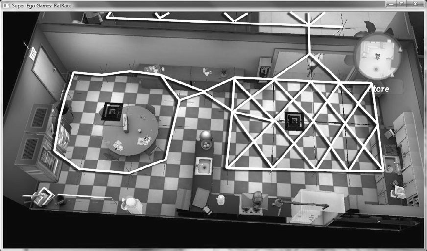

## AI tehnike

### Hard-Coded AI

In the early days of game programming, AI was often completely hard coded.

### Weighted randoms

Weighted randoms are a close cousin to the distribution curve. For example, let’s say I have a creature that can attack, cast a fire spell, or run away. I decide that 60% of the time I want this creature to attack, 30% of the time it should cast the fire spell, and 10% of the time it should run away.

Games have been using this technique with great success for years.

### Finite State Machines
vidi: konačni automat

### STRIPS tehnika
vidi: STRIPS

### Utility theory

Utility theory says that every state has a degree of or utility to an agent and that the agent will prefer states with higher utility. Primer GetUtility funkcije:

```cpp
function WorldState:GetUtility()
  local lifeScore = 100 * self.survivalChance;
  local attackScore = 100 - self.opponentHp;
  attackScore = attackScore + (attackScore * self.killChance);
  return lifeScore + attackScore;
end
```

Each line of code in this utility function directly affects the behavior and personality of this agent.
* The agent prefers states in which it is alive and has a good chance at remaining so.
* The agent prefers states in which the player is more injured.
* The agent greatly prefers states in which the player is near death.

### Goal-Oriented Action Planning (GOAP)

Utility theory is a great technique for deciding what an agent wants to do, but it’s not as good for deciding how an agent should perform the action. Goal-Oriented Action Planning is a popular methodology that helps solve this particular problem.

An example of a goal might be to kill the player. An action that satisfies this goal could be attacking the player. An agent often has multiple goals, although only one is typically active at any given time. The AI update is then split into two stages: The first selects the most relevant goal, and the second attempts to solve that goal by choosing an action or sequence of actions.

### PathFinding

Pathfinding is really just an optimized search algorithm across a data structure, typically a graph. The problem of finding a valid path through terrain is one of simplification. The world itself is simplified into a graph of nodes (or a mesh with edges) that is then traversed with a search algorithm to find a good path between two nodes in that graph.


