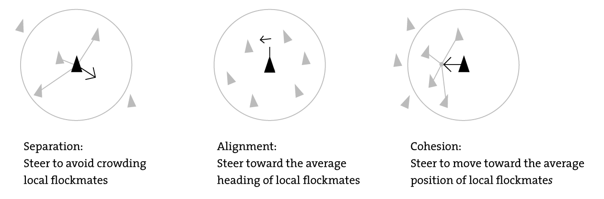

## Grupna dinamika

How we can emulate the movement patterns of groups of entities, whether it's a highly unorganized herd of mammals or a Roman cohort performing complex formations?

### Boids (birdoid objects)

One of the best examples of synthetic group behavior can be found in the boids algorithm introduced by Craig W. Reynolds in the 1990s. The algorithm was initially designed for creating movie special effects.

The boids algorithm allows the real-time simulation of flocks, herds, schools, and generally speaking, any creature that acts as part of a group with hardly any room for individuality. Interestingly enough, the boids algorithm can efficiently simulate traffic jams on a highway, pedestrian behaviors, and many other human activities as well as simple animal behavior.

The core hypothesis of the boids system is that the behavior of a group is largely governed by a relatively small set of rules. After some research, he found that flocking behavior could easily be modeled with as few as three rules:

* Separation: Each member of the group will try to prevent having another member closer than a set threshold, thus avoiding a collision within the flock. If a member invades the area of influence of another member, they must both correct their orientation to try and separate.
* Alignment: All members of a group will try to aim in the same direction, much like a herd of sheep would do.
* Cohesion: All members of the group should try to stay close to the group's center of gravity or barycenter. By doing so, the flock stays together, except for those circumstances when the separation rule needs to be enforced.



Some changes need to be made in order to increase the boids potential. We need someone to generate the influence field so the others will conform to this behavior. For example, one of the members of the formation must be AI (or the player).

### Formation-Based Movement

Moving in formation is more involved than acting like a flock of birds. Any error in our alignment or speed will generate unwanted collisions and quite likely will end up breaking up the group.

In a simple approach, you can totally discard the individual component and make the whole squadron act as a single soldier. For example, a squadron consisting of 60 men in 6 ranks (10 men per rank) can be represented by its barycenter and yaw vector:

```c
#define SPACING 2;
for (int xi = 0; xi < COLUMNS; xi++) {
   for (int zi = 0; zi < RANKS; zi++) {
      point pos(xi - (COLUMNS/2), 0, zi-(RANKS/2));
      pos = pos * SPACING;
      pos.rotatey(yaw);
      pos.translate(barycenter);
      }
   }
```

This approach has a limitation: We cannot assign individual behaviors. For example, the whole troop will change its trajectory to avoid a tree.
