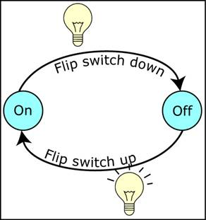
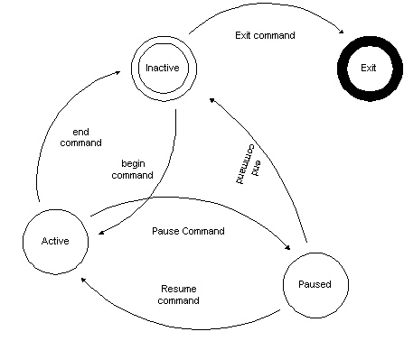

## Dijagram stanja

Dijagram stanja se koristi za shematski prikaz konačnih automata.

### Primer: Dva stanja

Na slici imamo:
- 2 stanja (upaljeno, ugašeno)
- 2 prelaza (paljenje, gašenje)

### Primer: Više stanja

Na slici imamo:
- 4 stanja (Inactive, Active, Paused, and Exited)
- 5 prelaza (Begin Command, End Command, Pause Command, Resume Command, Exit Command)
