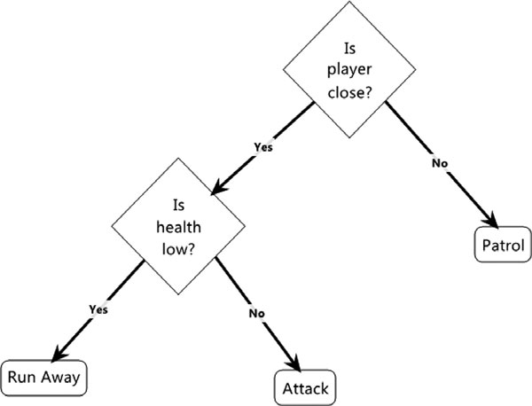

### Drvo odluka

A decision tree is a simple way of representing decision making. Each nonleaf node in the tree is called a decision node, and it represents a single decision with a binary yes/no answer. Each leaf node is called an action node, and it represents an action (a new state).

A decision is made by starting at the root node and recursively walking down the tree until an action node is reached.

(primer za stražara)

The diamonds represent decision nodes, while the rounded rectangles represent action nodes.
