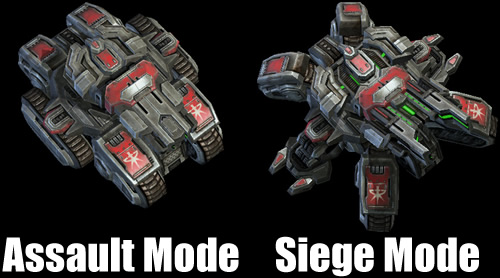

# Konačni automat

Konačni automat ili mašina konačnih stanja (*Finite-state machine*) je logički model koji se uglavnom koristi za veštačku inteligenciju neprijatelja u razvoju igara. Sastoji se od konačnog broja stanja i akcija koje ih povezuju.

Kada pravimo automat konačnih stanja, uglavnom znamo stanja unapred (jer su konačna). Only a single state can be active at the same time, so the machine must transition from one state to another in order to perform different actions.

Konačni automat se sastoji od states, inputs and transitions:
* You have a fixed set of states that the machine can be in.
* The machine can only be in one state at a time.
* A sequence of inputs (events) is sent to the machine.
* Each state has a set of transitions, associated with an input and pointing to a state.

Most games are deterministic; meaning you know how the enemies will react. If they don’t see you, they’ll patrol. If they see you, they’ll attack you. You can simulate fuzzy logic by change state to something random. For example, sometimes the enemy could use a grenade vs. a gun, or attack you immediately vs. sounding the alarm… This randomness makes a State Machine non-deterministic, meaning you know all the States, but you don’t know the paths between.

Starcraft Siege tank can’t go from Siege Mode to Move Mode. Siege Tank must first transform to assault mode.

## Vizuelizacija

Mašina stanja može biti predstavljena grafikonom, gde su čvorovi (*nodes*) stanja, a grane (*edges*) prelazi. Mašina stanja takođe može biti predstavljena tabelarno.

## Reuse

One of the big advantages of state machines is that states can often be reused among many different creatures. The chances are good that you’ll get a lot of use out of a patrol or attack state, and with a bit of parameterization you can reuse these states across many different types of creatures.

https://gamedevelopment.tutsplus.com/tutorials/finite-state-machines-theory-and-implementation--gamedev-11867
http://www.drdobbs.com/cpp/state-machine-design-in-c/184401236
http://codereview.stackexchange.com/questions/104989/state-machine-implementation
