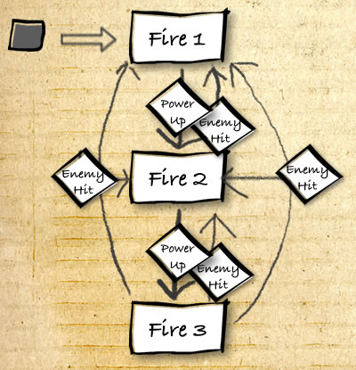

## Avionče iz 1942.

Airplane has 3 firing modes:
* a single bullet,
* faster dual-bullets, and
* a 3 pronged super-fast bullet mode.

So, we have 3 states, with Fire 1 being the initial state. The events between states are when the plane touches a power up. If the plane hits an enemy, they’ll go back a state, from Fire 3 to Fire 2 and from Fire 2 to Fire 1.



Implementacija u kodu:

```js
if state == "fire1" then
    fireFunkyFunk = player.fire1
    fireSpeed = 300
elseif state == "fire2" then
    fireFunkyFunk = player.fire2
    fireSpeed = 200
elseif state == "fire3" then
    fireFunkyFunk = player.fire3
    fireSpeed = 150
end
```
