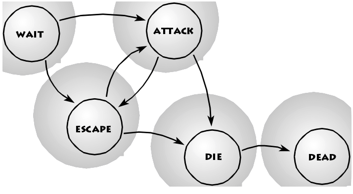

## Robot

We could define the following behavioural states: Waiting, Attacking, Escaping, Dying, and Dead. The arrows indicate the transitions between states, which may be triggered by events.

At the start of the game the robot is to be in the WAIT state. If the player comes near he will change into the ATTACK state. If the player hits him with his gun, the following transition depends on the robot's remaining health, i.e. the number of hits he had already been forced to take: the next state will either be ATTACK, ESCAPE, or DIE.



For better transparency we sum up the states in a table of states.


### Implementacija

```js
action robot {
  MY._WALKFRAMES = 1;
  MY._ENTFORCE = 0.7;
  MY._ARMOR = 100;
  MY._HEALTH = 100;
  MY.enable_scan = ON; // sensible of explosions
  MY.enable_shoot = ON; // sensible of gunshots
  MY.event = fight_event; // handle hits
  state_wait(); // First state: watch for the player
}
```

```js
function state_wait() {
  while (1) {
    if (MY._HEALTH <= 0) {
      state_die();
      return;
    }
    wait(1);
  }
}
```

```js
function fight_event() {
  if (((EVENT_TYPE == EVENT_SCAN) && (indicator == _EXPLODE)))
    ||
    ((EVENT_TYPE == EVENT_SHOOT) && (indicator == _GUNFIRE)) {
      if (MY._ARMOR <= 0) {
        MY._HEALTH -= damage;
      } else {
        MY._ARMOR -= damage;
      }
    }
}
```

```js
function state_escape() {
  while (1) {
    if (MY._HEALTH <= 0) {
      state_die();
      return;
    }
    // turn away from player
    temp.X = MY.X - player.X;
    temp.Y = MY.Y - player.Y;
    temp.Z = MY.Z - player.Z;
    vec_to_angle(my_angle, temp);
    actor_turn();
    // walk away
    force = MY._ENTFORCE * 4;
    actor_move();
    wait(1);
  }
}
```

```js
function state_die() {
  MY._ANIMDIST = 0; // reset entity's animation time to zero
  while (MY._ANIMDIST < 100) {
    SET_FRAME MY, anim_death_str, MY._ANIMDIST; // set the frame from the percentage
    MY._ANIMDIST += 5.0 * TIME; // calculate next percentage for death in ~1.25 seconds
    wait(1);
  }
  MY.enable_scan = OFF; // get insensible
  MY.enable_shoot = OFF;
  MY.event = NULL; // and don't react anymore
}
```
