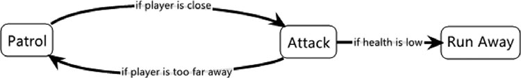

### Stražar

We want to make a guard that patrols an area until the player gets within a radius and then attacks. If the player gets too far away, he resumes his patrol. If his health gets too low during the fight, he runs away. To do this with a state machine, you need three states: one for pacing behavior, second for the attack, and the third for the running away.

