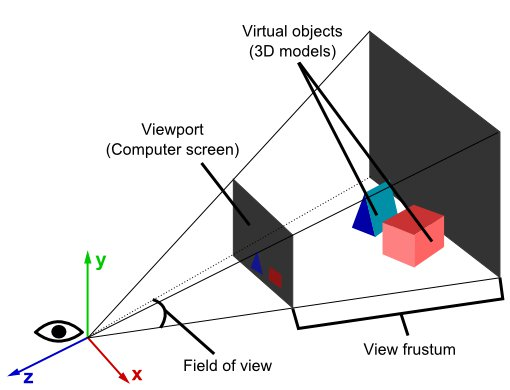

# 3D projekcija

3D projekcija je mapiranje trodimenzionalnog prostora na dvodimenzionalnu ravan.

Svet je trodimenzionalan, ali ekran na kome ga prikazujemo je uvek 2D.



We store 3D coordinates in code. However, a screen can only display 2D coordinates so we need a way to transform our 3D coordinates into 2D ones. The 3D to 2D projection is an abstract math operation, usually made by an object called a virtual camera. This camera converts a 3D coordinates into 2D ones, to send them to the renderer, which will display them on the screen.

## Primena

You start with coordinates in 3D space (space_x, space_y and space_z) and you want to turn them into coordinates on the screen (screen_x and screen_y). That means you have to make one number disappear, namely space_z. How can you do that? By dividing everything by space_z!

```
screen_x = space_x / space_z
screen_y = space_y / spaze_z
```

## Ortografska i perspektivna projekcija


Poseban repo:
https://github.com/skolakoda/ucimo-3d-projekciju

Linkovi:
http://alfonse.bitbucket.org/oldtut/Positioning/Tut04%20Perspective%20Projection.html
http://ogldev.atspace.co.uk/www/tutorial12/tutorial12.html
