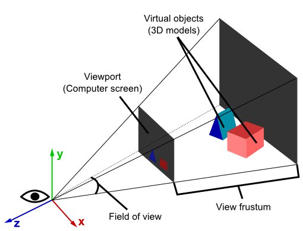

# Projekcija

A projection is a way to transform a world from one dimensionality to another.

Finite projections only project objects onto a finite space of the lower dimensionality. For a 3D to 2D projection, there is a finite plane on which the world is projected. For 2D to 1D, there is a bounded line that is the result of the projection.

# 3D projekcija
> Projektovanje možemo zamisliti kao bacanje senke

3D projekcija je mapiranje trodimenzionalnog prostora na dvodimenzionalnu ravan (It's like taking a photo). Svet je trodimenzionalan, ali ekran na kome ga prikazujemo je uvek 2D.

Proces:
* define 3D coordinates in code
* transform 3D coordinates into 2D ones (transformations of vertex positions)
* render 2D coordinates on screen



The 3D to 2D projection is an abstract math operation, usually made by the camera object.

# Primena

You start with coordinates in 3D space (space_x, space_y and space_z) and you want to turn them into coordinates on the screen (screen_x and screen_y). That means you have to make one number disappear, namely space_z. How can you do that? By dividing everything by space_z!

```
screen_x = space_x / space_z
screen_y = space_y / spaze_z
```


Poseban repo:
https://github.com/skolakoda/ucimo-3d-projekciju

https://developer.mozilla.org/en-US/docs/Web/API/WebGL_API/WebGL_model_view_projection