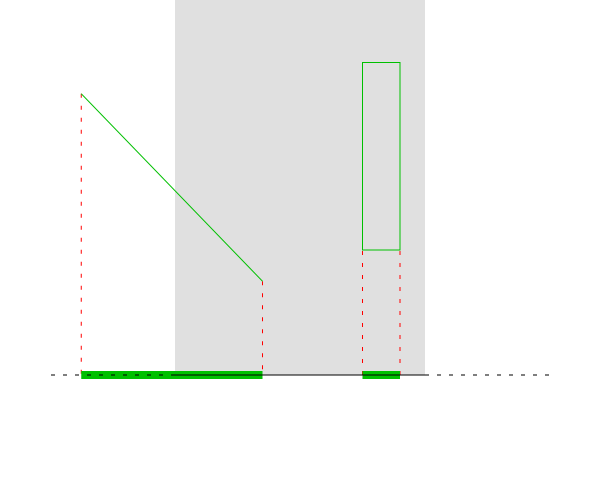
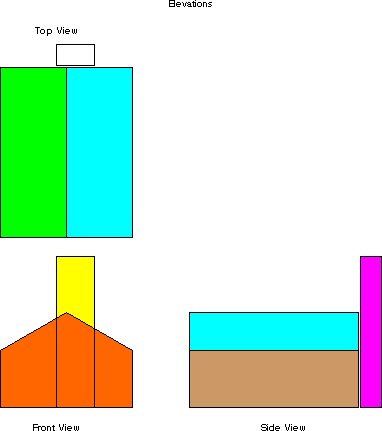

# Ortografska (paralelna) projekcija

An orthographic projection is a very simplistic projection. When projecting onto an axis-aligned surface, the projection simply throw away the coordinate perpendicular to the surface.

Na slici je prikazana 2D to 1D Orthographic Projection:



A simple orthographic projection onto the plane z = 0 can be defined by the following matrix:
```
[ 1 0 0
  0 1 0
  0 0 1 ]
```

Often, it is more useful to use homogeneous coordinates. The transformation above can be represented for homogeneous coordinates as:
```
[ 1 0 0 0
  0 1 0 0
  0 0 1 0
  0 0 0 1 ]
```

One of the most frequent parallel projections are the front, top and side views of the object (elevations). The projections are given by the functions:

```
frontP(x,y,z) = (x,z)
sideP(x,y,z) = (y,z)
topP(x,y,z) = (x,y)
```



Human eyes do not see the world via orthographic projection.
