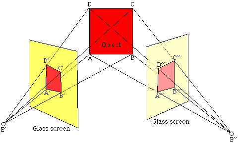
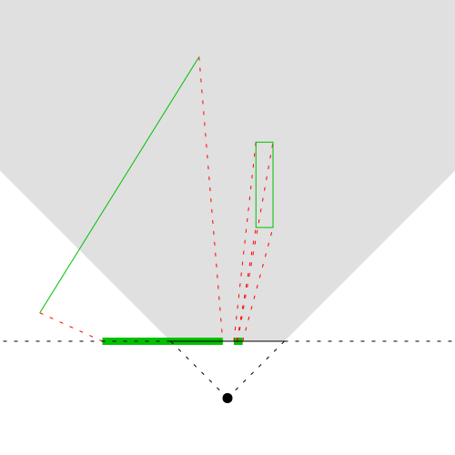
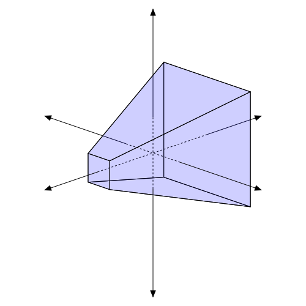
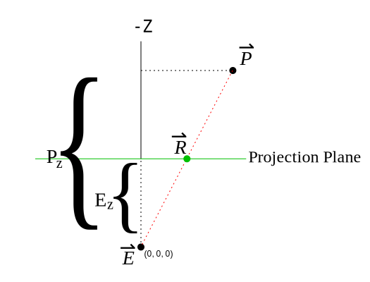
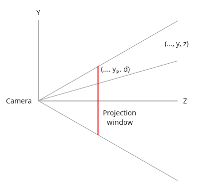
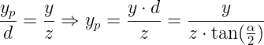

# Perspektivna projekcija

3D graphics najbolje predstavlja projekcija from the 3D world on a 2D plane, while maintaining the appearance of depth. The farther an object is from the camera, the smaller it appears in the final image. It's similar to how our eye works.



Unlike the above projection type, perspective projection relies on the concept of a focal point.

A perspective projection is a projection of the world on a surface as though seen through a single point. A 2D to 1D perspective projection looks like this:



An orthographic projection only captures the rectangular prism directly in front of the surface of projection. A perspective projection captures a larger space of the world.

In 2D, the shape of the perspective projection is a regular trapezoid (a quadrilateral that has only one pair of parallel sides, and the other pair of sides have the same slope). In 3D, the shape is called a frustum; essentially, a pyramid with the tip chopped off.



The viewing volume for a 3D perspective projection is a frustum of a pyramid, a truncated pyramid whose top has been cut off by a plane parallel to its base.


# Primer

Najjednostavnija perspektivna matrica:
[ 1  0  0  0
  0  1  0  0
  0  0  1  0
  0  0 -1  0 ]

# Računanje perspektive

We will be making a few simplifying assumptions:

* The plane of projection is axis-aligned and faces down the -Z axis (-Z is farther away).
* The eye point is fixed at the origin (0, 0, 0).
* The size of the plane of projection will be [-1, 1]. All points that project outside of this range are not drawn.

A perspective projection essentially shifts vertices towards the eye, based on the location of that particular vertex. Vertices farther in Z from the front of the projection are shifted less than those closer to the eye. And the shift also depends on how far the vertices are from the center of the plane of projection, in the X,Y direction.

The problem is really just a simple geometry problem. Here is the equivalent form in a 2D to 1D perspective projection - the projection of the point P onto the projection plane (green):



R is the projected point. This plane is at an offset of Ez compared to the eye point, which is fixed at the origin.

We have two similar right triangles: manji (E, R i Ez) i veći (E, P i Pz). We have the eye position and the position of the unprojected point. To find the location of R, we simply do this:


```
R = P * (Ez / Pz)
```
Since this is a vectorized function, this solution applies equally to 2D as to 3D. Thus, perspective projection is simply the task of applying that simple formula to every vertex.

# Perspective projection tranformation

The perspective projection tranformation will require us to supply 4 parameters:

* The aspect ratio - the ratio between the width and the height of the rectangular area which will be the target of projection.
* The vertical field of view: the vertical angle of the camera through which we are looking at the world.
* The location of the near Z plane. This allows us to clip objects that are too close to the camera.
* The location of the far Z plane. This allows us to clip objects that are too distant from the camera.

The aspect ratio (`screen width / screen height`) is required since we are going to represent all coordinates in a normalized space whose width is equal to its height.

The vertical field of view allows us to zoom in and out on the world.

In the picture on the left the angle is wider which makes objects smaller while in the picture on the right hand side the angle is smaller which makes the same object appear larger. Note that this has an effect on the location of the camera.


We start by determining the distance of the projection plane from the camera. Obviously, not the entire plane is visible. We can only see stuff in a rectangular area (the projection window) which has the same proportions of our screen.

Visina of the projection window is `2`, sto znači da je širina `2 * aspect ratio`. If we place the camera in the origin and look at the area we will see the following:


Anything outside this rectangle is going to be clipped away. Now let's take a look "from the side" (looking down at the YZ plane):


We find the distance from the camera to the projection plane using the vertical field of view (denoted by the angle alpha):


The next step is to calculate the projected coordinates of X and Y. Consider the next image (again looking down at the YZ plane).



We have a point in the 3D world with the coordinates (x,y,z). We want to find (xp, yp) that represent the projected coordinates. We'll start with Y. According to the rule of similar triangles we can determine the following:



In the same manner for the X component:


Since our projection window is `2 * ar` (width) `by 2` (height), a vertex is inside the window if is projected to a point whose `X` is between `-ar` and `+ar` and the `Y` is between -1 and +1.

We have reached the following projection equations for the X and Y components:


[...]

Therefore, the final transformation matrix is:


Implementacija funkcije:
```c
void Pipeline::InitPerspectiveProj(Matrix4f& m) const>
{
    const float ar = m_persProj.Width / m_persProj.Height;
    const float zNear = m_persProj.zNear;
    const float zFar = m_persProj.zFar;
    const float zRange = zNear - zFar;
    const float tanHalfFOV = tanf(ToRadian(m_persProj.FOV / 2.0));

    m.m[0][0] = 1.0f / (tanHalfFOV * ar);
    m.m[0][1] = 0.0f;
    m.m[0][2] = 0.0f;
    m.m[0][3] = 0.0f;

    m.m[1][0] = 0.0f;
    m.m[1][1] = 1.0f / tanHalfFOV;
    m.m[1][2] = 0.0f;
    m.m[1][3] = 0.0f;

    m.m[2][0] = 0.0f;
    m.m[2][1] = 0.0f;
    m.m[2][2] = (-zNear - zFar) / zRange;
    m.m[2][3] = 2.0f * zFar * zNear / zRange;

    m.m[3][0] = 0.0f;
    m.m[3][1] = 0.0f;
    m.m[3][2] = 1.0f;
    m.m[3][3] = 0.0f;
}
```

http://ogldev.atspace.co.uk/www/tutorial12/tutorial12.html
