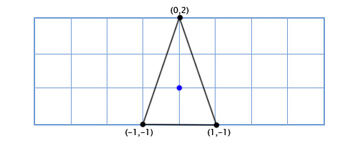
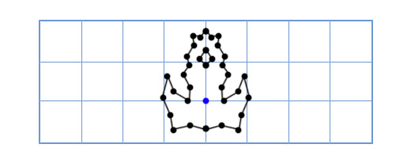

# Rotacija (vrtnja)

U dve dimenzije, prilično je lako izraziti orijentaciju tela. Pošto postoji samo jedna moguća osa rotacije, jedina informacija koja nam je potrebna je ugao.

Međutim, u tri dimenzije postoje tri primarne ose oko svake od kojih telo može da rotira. Štaviše, telo u tri dimenzije može da rotira oko bilo koje proizvoljne ose, ne nužno neke od koordinatnih osa.

## Primer: Tarzan

Na primer, igrač može da skoči na konopac i da se ljulja sa jedne platforme na drugu. Možete da primenite ljuljanje kao rotaciju oko tačke gde je konopac pričvršćen. Da biste to uradili, morate izračunati vektor koji ide od igrača do centra rotacije, uzeti ugao ovog vektora, malo ga povećati i ponovo izračunati poziciju igrača.

Ugao vektora od igrača do centra rotacije računamo pomoću atan2(). Nakon što povećamo ugao, možemo izračunati nove `x` i `y` koordinate sa `sin` i `cos`:

```js
ugao = atan2(y, x)
duzina = sqrt(x * x + y * y)
ugao += 1
nov_x = duzina * cos (ugao)
nov_y = duzina * sin (ugao)
```

Pošto konvertujemo iz kartezijanskih koordinata u polarne, a zatim ponovo nazad, možemo izgubiti preciznost. Postoji bolji način: matrica rotacija. Matrica rotacija omogućuje rotiranje vektora bez pretvaranja u polarne koordinate:

```js
nov_x = x * cos(ugao) - y * sin(ugao)
nov_y = x * sin(ugao) + y * cos(ugao)
```

Ovim metodom možemo praviti rotacije bez `atan2`. 

P.s. Razumno je unapred izračunati `cos` i `sin`, jer nam treba dvaput.

## Posebni slučajevi

I kod rotacije za 90 stepeni možemo koristiti istu formulu:

```js
nov_x = x * cos(90) - y * sin(90)
nov_y = x * sin(90) + y * cos(90)
```

Ali cos(90) je 0, a sin(90) je 1, pa možemo uprostiti:

```js
nov_x = x * 0 - y * 1 = -y
nov_y = x * 1 + y * 0 = x
```

Rotacija za 180 stepeni se svodi na:

```js
nov_x = -x
nov_y = -y
```

Ovde su svi specijalni slučajevi, tj. četvrtine kruga:

| rotacija | 90 | 180 | 270 | 360 |
| ------- |:--:| :--:|:---:|----:|
| x       | -y | -x  | y   | x   |
| y       | x  | -y  | -x  | y   |

## Primer: Svemirski brod

Recimo da pravimo igru Asteroidi, i imamo jednostavan 2D svemirski brod koji se može slobodno rotirati. Model broda izgleda ovako:



Kako ga nacrtati kada se igrač rotira za proizvoljan ugao, na primer za 49 stepeni u smeru suprotnom od kazaljke? Pa, trigonometrijom možemo kreirati funkciju za 2D rotaciju, koja prima jednu tačku i ugao, te vraća rotiranu tačku:

```java
vec2 rotate(vec2 point, float angle){
   vec2 rotated_point;
   rotated_point.x = point.x * cos(angle) - point.y * sin(angle);
   rotated_point.y = point.x * sin(angle) + point.y * cos(angle);
   return rotated_point;
}
```

Primenom ovoga na naše tri tačke dobijamo sledeći oblik:


Operacije kosinusa i sinusa su prilično spore, ali mi ih radimo samo na tri tačke. Međutim, sada odlučujemo da nadogradimo brod da izgleda ovako:



Sada je naša stara metoda prespora! Postoji mnogo načina da se reši ovaj problem, ali elegantno rešenje glasi ovako: „Šta ako umesto da rotiramo svaku tačku modela, rotiramo samo `x` i `y` ose modela?“


Kako ovo radi? Pa, hajde da pogledamo šta znače koordinate. Kada govorimo o tački (3,2), kažemo da je njen položaj tri puta `x` osa plus dva puta `y` osa. Podrazumevane ose su (1,0) za x-osu i (0,1) za y-osu, tako da dobijamo poziciju 3(1,0) + 2(0,1). Ali ose ne moraju biti (1,0) i (0,1). Ako rotiramo ove ose, onda možemo rotirati svaku tačku u isto vreme.

Da bismo dobili rotirane `x` i `y` ose, samo koristimo prethodnu trigonometrijsku funkciju. Na primer, ako rotiramo za 49 stepeni, onda dobijamo novu `x` osu rotacijom (1,0) za 49 stepeni a novu `y` osu rotacijom (0,1) za 49 stepeni. Dakle, nova x-osa je (0,66, 0,75), a nova y-osa (-0,75, 0,66).

Kad god modifikujemo osnovne vektore (1,0) i (0,1) u (a,b) i (c,d), onda se modifikovana tačka (x,y) može naći pomoću ovog izraza:

```
x(a,b) + y(c,d)
```

Rotate function is more elegantly expressed in matrix form:

```
[cos(θ) -sin(θ)
 sin(θ)  cos(θ)]
```

## 3D rotacija

Rotacija oko Z ose radi isto kao u 2D. Moramo samo dodati dodatnu kolonu i red:

```
[cos(θ) -sin(θ) 0
 sin(θ)  cos(θ) 0
 0       0      1]
```

Podrazumevano, matrica rotacije rotira objekat u odnosu na ishodište.

## Ojlerovi uglovi

Postoje dva pristupa rotiranju 3D objekata. Jedna metoda koristi kvaternione, ali matematika je složena. Drugi metod je Ojlerova rotacija, veoma slično skaliranju i prevođenju.

Tri Ojlerova ugla (*roll*, *pitch*, and *yaw*) predstavljaju orijentaciju tela u 3D. Na primer, nos aviona se naginje (*pitches*) naviše ili naniže, avion se uvija (*rolls*) ulevo ili udesno, i skreće (*yaw*) na levu ili desnu stranu.
