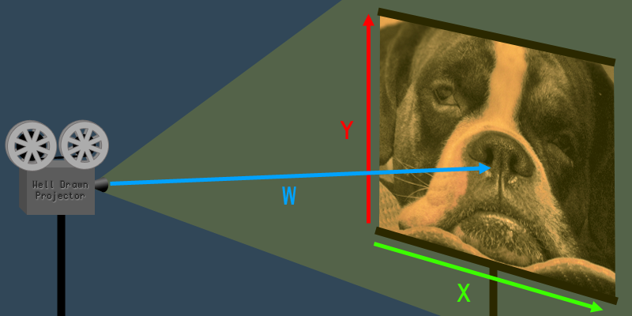
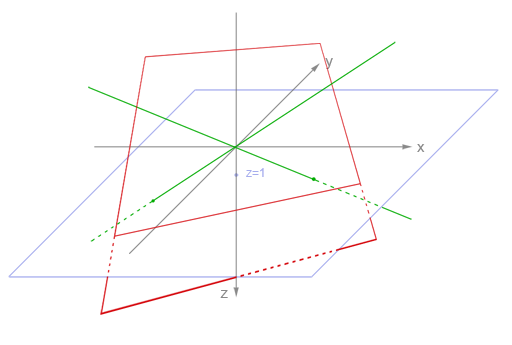
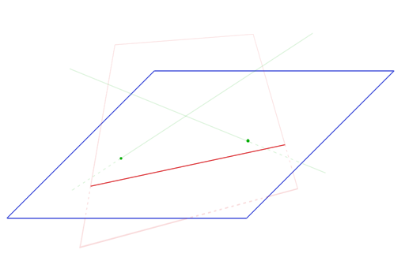

# Homogene koordinate (a.k.a. 4D coordinates) 
> 4D vectors for matrix multiplication

## Terminology

Most of the time when working with 3D, we are thinking in terms of 3D coordinates (X, Y, and Z). However, there are certain situations where it is useful to think in terms of projective geometry instead. Projective geometry has an extra dimension, called W. This four-dimensional space is called "projective space," and coordinates in projective space are called "homogeneous coordinates."

Quaternions look a lot like homogeneous coordinates. Both are 4D vectors, commonly depicted as (X,Y,Z,W). However, quaternions and homogeneous coordinates are different concepts, with different uses.

## An Analogy In 2D

Imagine a projector that is projecting a 2D image onto a screen. The W dimension is the distance from the projector to the screen.



Imagine what would happen to the 2D image if you increased or decreased W – that is, if you increased or decreased the distance between the projector and the screen. If you move the projector closer to the screen, the whole 2D image becomes smaller. If you move the projector away from the screen, the 2D image becomes larger. As you can see, the value of W affects the size (a.k.a. scale) of the image.

In 3D, the W value works exactly the same as it does in 2D. When W increases, the coordinate expands (scales up). When W decreases, the coordinate shrinks (scales down). The W is basically a scaling transformation for the 3D coordinate.

The usual advice for 3D programming beginners is to always set W=1 whenever converting a 3D coordinate to a 4D coordinate. The reason for this is that when you scale a coordinate by 1 it doesn't shrink or grow, it just stays the same size. If you rendered coordinates with W>1 then everything would look too small, and with W<1 everything would look too big. If you tried to render with W=0 your program would crash when it attempted to divide by zero. With W<0 everything would flip upside-down and back-to-front.

## The Math

Let's say that the projector is 3 meters away from the screen, and there is a dot on the 2D image at the coordinate (15,21). This gives us the projective coordinate vector (X,Y,W)=(15,21,3).

Now, imagine that the projector was pushed closer to the screen so that the distance was 1 meter. The closer the project gets to the screen, the smaller the image becomes. The projector has moved three times closer, so the image becomes three times smaller. If we take the original coordinate vector and divide all the values by three, we get the new vector where W=1:

(15/3,21/3,3/3)=(5,7,1)

The dot is now at coordinate (5,7).

The process is exactly the same for 2D and 3D coordinates.

## Translation Matrices For 3D Coordinates

Rotation and scaling transformation matrices only require three columns. But, in order to do translation, the matrices need to have at least four columns. This is why transformations are often 4x4 matrices.

However, a matrix with four columns can not be multiplied with a 3D vector, due to the rules of matrix multiplication. A four-column matrix can only be multiplied with a four-element vector, which is why we often use homogeneous 4D vectors. The 4th dimension W is usually unchanged, when using homogeneous coordinates in matrix transformation.

The notable exception is projection matrices, which do affect the W dimension.

## Perspective Transformation

Perspective is implemented in 3D computer graphics by using a transformation matrix that changes the W element of each vertex. 

The Z element of each vertex represents the distance away from the camera. Therefore, the larger Z is, the more the vertex should be scaled down. The W dimension affects the scale, so the projection matrix just changes the W value based on the Z.

After the perspective projection matrix is applied, each vertex undergoes "perspective division." Perspective division is just a specific term for converting the homogeneous coordinate back to W=1.

After perspective division, the W value is discarded, and we are left with a 3D coordinate that has been correctly scaled according to a 3D perspective projection.

## Drugo objašnjenje

Usually gamedevs describe homogeneous coordinates like this: 

You add a fourth coordinate to your Vec3 and call it `w`. And w is usually set to 1. Now you can do a rotation and translation using a single `matrix * vector` operation. 

And when you do a projection, then the result will have `w != 1`. To get the projected point you have to divide by w so that in (x/w, y/w, z/w, 1) w equals 1 again. That’s called normalization!

Homogeneous coordinates were introduced in linear algebra to describe projective spaces. 
 
Homogeneous coordinates add another dimension, namely the w-coordinate. So, homogeneous 3D coordinates are extended with a fourth coordinate w. Two vectors (x,y,z,w) and (x’,y’,z’,w’) represent the same point in 3D space if one is a multiple of the other. (x,y,z,1) is called the normalized form. Points of the form (x,y,z,0) are again called “vanishing points”.

Projective geometry lets you write affine transforms using a single matrix operation. It also let’s you write projections using a matrix operation. The simplest being (x,y,z,1) -> (x,y,z,z) . After renormalization we get (x/z,y/z,1,1). But keep in mind: In projective space (x/z,y/z,1,1) and (x,y,z,z) represent the same point.

The term “normalized” can be confusing when it comes to homogeneous coordinates. To clear this up: When we deal with homogeneous coordinates (x, y, z, w), then the normalized form means w==1. When talking about ordinary 3d coordinates, then normalized means length==1. 

As you can see, the green lines through the origin intersect the plane in points, and the red plane intersects the plane in a line. The plane z=1 is called an affine view of the projective plane.



All lines of the form k*(x,y,z) where z is not zero will intersect our affine view, the z=1 plane. k*(x,y,z) are called the homogeneous coordinates of a line on a projective 3D space. For example if k*(12,8,4) are the coordinates for one line then (12,8,4) is one representative and (3,2,1) is its normalized form.

When remove the coordinate axes from the drawing, all that’s left is our affine view, which looks just like a standard 2D plane with green points and a red line.



## Cartesian into a homogeneous coordinate

a pair of simple functions:
```
function cartesianToHomogeneous(point) {  
  var x = point[0];
  var y = point[1];
  var z = point[2];
  
  return [x, y, z, 1];
}

function homogeneousToCartesian(point) {
  var x = point[0];
  var y = point[1];
  var z = point[2];
  var w = point[3];
  
  return [x/w, y/w, z/w];
}
```

The final benefit of using homogeneous coordinates is that they fit very nicely for multiplying against 4x4 matrices. The 4x4 matrix can be used to encode a variety of useful transformations.

The clipping from clip space actually happens after the homogeneous coordinates have been transformed back into Cartesian coordinates (by dividing by w). This final space is known as "normalized device coordinates" or NDC.


http://deltaorange.com/2012/03/08/the-truth-behind-homogenous-coordinates/
