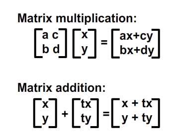
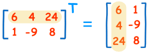
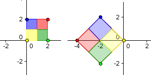
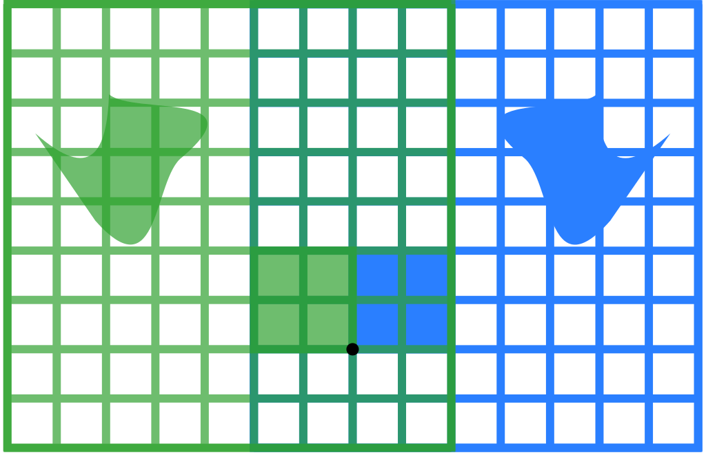
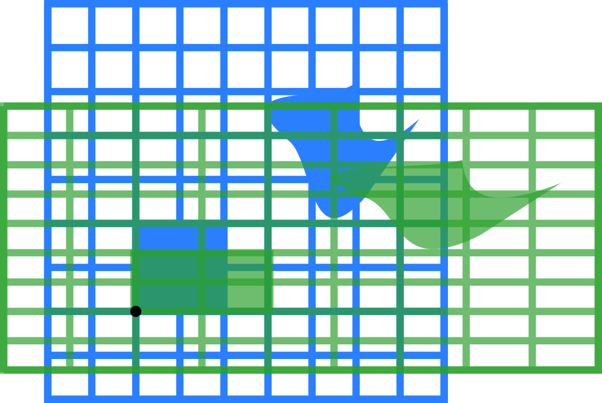
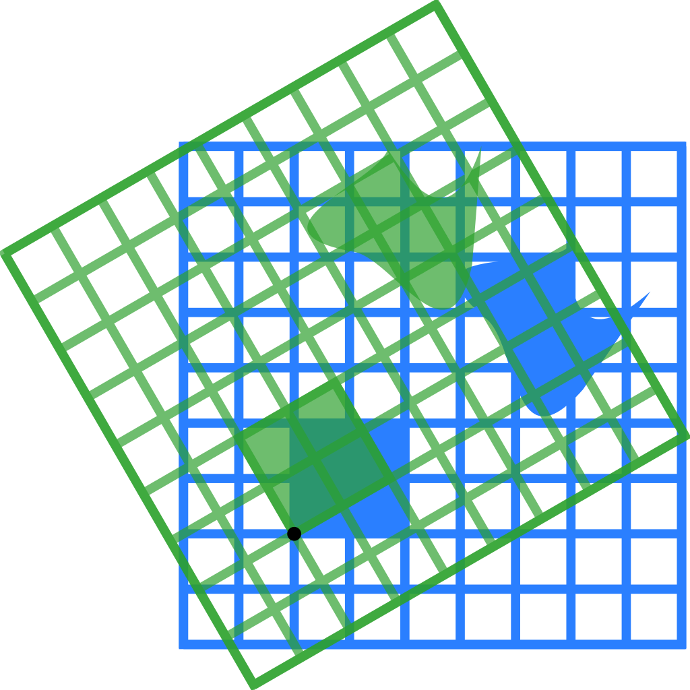
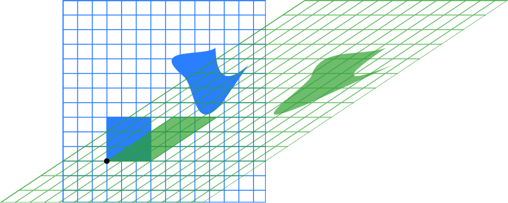
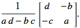

# Matrice

Matrica je niz brojeva, poređanih u redove i kolone. Tj. matrice su tabele brojeva.

Za kvadratnu šemu brojeva kažemo da je matrica tipa m x n, to znači da ima m redova i n kolona. Ako matrica ima isti broj vrsta i kolona, za nju kažemo da je kvadratna matrica.

Matrica -A je suprotna matrica za matricu A.

The dimensions of a matrix tells its size: the number of rows and columns of the matrix, in that order.

When working with matrix dimensions, remember rows × columns!

## Rotacija matrice?

Matrices are like 2-dimensional vectors. For example, a typical 2x2 matrix might look like this:

   [a c
    b d]

When you multiply a matrix by a vector, you sum the dot product of each row of the matrix with the vector. For example, if we multiply the above matrix with the vector (x,y), we get:

```
(a,c)•(x,y) + (b,d)•(x,y)
```

Written another way, this is:
```
x(a,b) + y(c,d)
```

This is the exact same expression that we use when changing the basis vectors! So, multiplying a 2x2 matrix with a 2D vector is the same as changing its basis vectors. For example, if we plug the standard basis vectors (1,0) and (0,1) into the matrix columns, we get:

[1 0
 0 1]

This is the identity matrix, which has no effect, as we would expect. If we plug in our 49-degree rotation bases, we get:

[0.66 -0.75
 0.75  0.66]

This matrix will rotate any 2D vector counter-clockwise by 49 degrees.

## Operacije nad matricama

Matrices can be added, multiplied, transposed, and inverted.

Matrix operations can be used to move 2D objects around on the screen and manipulate 3D objects within the world coordinate system.

### Sabiranje i oduzimanje matrica



Mogu se sabirati i oduzimati samo matrice istog tipa.

Always make sure that both matrices are the same size before you attempt to add them. If A and B are both 3x3, so you can add them together.

Here is a sample function that shows how to add matrices in code:

```c
Matrix3X3 addMatrices(Matrix3X3 a, Matrix3X3 b)
{
  Matrix3X3 temp;
  for(int i = 0; i<3; i++){
    for(int j=0; j<3; j++){
      temp.index[i][j] = (a.index[i][j] + b.index[i][j]);
    }
  }
  return temp;
}
```

Subtracting matrices works exactly the same way; you just subtract corresponding entries.

### Množenje matrice skalarom

Matrica se množi brojem tako što se svi elementi matrice pomnože tim brojem.

### Množenje matrica

Proizvod dve matrice je definisan samo ako je broj kolona prve matrice jednak sa brojem redova druge matrice.

Za matrice u opštem slučaju ne važi komutativnost množenja.

You can multiply matrices by taking a series of dot products. Keep in mind two important aspects of the dot product:
* The two vectors must have the same number of entries to take the dot product.
* The dot product returns a scalar quantity (a single number).


Here is a function that allows us to multiply two 3x3 matrices:
```cpp
Matrix3X3 multiply3X3Matrices(Matrix3X3 a, Matrix3X3 b) {
  Matrix3X3 temp = createFixed3X3Matrix(0);
  for (int i = 0; i < 3; i++) {
    for (int j = 0; j < 3; j++) {
      for (int k = 0; k < 3; k++) {
        temp.index[i][j] += (a.index[i][k] * b.index[k][j]);
      }
    }
  }
  return temp;
}
```

This process is only slightly different when multiplying two different sized matrices:
```cpp
Matrix3X1 multiplyMatrixNxM(Matrix3X3 a, Matrix3X1 b) {
  Matrix3X1 temp;
  temp.index[0] = 0.0 f;
  temp.index[1] = 0.0 f;
  temp.index[2] = 0.0 f;
  for (int i = 0; i < 3; i++) {
    for (int j = 0; j < 3; j++) {
      temp.index[i] += (a.index[i][j] * b.index[j]);
    }
  }
  return temp;
}
```

### Transponovana matrica

The transpose operation simply swaps each entry's row and column.



How to transpose a 4x4 matrix in code:
```cpp
Matrix4X4 transpose4X4Matrix(Matrix4X4 a) {
  Matrix4X4 temp;
  for (int i = 0; i < 4; i++) {
    for (int j = 0; j < 4; j++) {
      temp.index[i][j] = a.index[j][i];
    }
  }
  return temp;
}
```

## Linearna transformacija
> primeri su mahom 2D. The blue original is mapped to the green grid and shapes. The origin (0,0) is marked with a black point.



Linearna transformacija vrši se tako što se transformaciona matrica pomnoži sa izvornom matricom.

What makes a transformation linear is the following geometric rule: The origin must remain fixed, and all lines must remain lines.

### Identitet

Jedinična (ili identična) matrica je kvadratna matrica kojoj su elementi na glavnoj dijagonali jedinice, a ostali nule. Ona u množenju ne menja druge matrice (slično kao broj 1).

Za 2D:
```
[ 1 0
  0 1 ]
```

Za 3D:
```
[ 1 0 0
  0 1 0
  0 0 1 ]
```

I tako dalje do N dimenzija...

### Preslikavanja (refleksija)

Reflection through the vertical axis:
```
[ -1 0
   0 1  ]
```


### Stretching

Transformation matrix associated with a stretch by a factor `k` along the x-axis:

```
[ k 0
  0 1 ]
```

Similarly, transformation matrix associated with a stretch by a factor `k` along the y-axis:
```
[ 1 0
  0 k ]
```

### Skaliranje

Scaling by a factor of 3/2:
```
[ 3/2  0
   0  3/2 ]
```


### Stiskanje (*squeeze*)

Squeeze mapping with r=3/2:
```
[ 3/2  0
   0  2/3 ]
```


### Rotation
Transformation matrix for a rotation counter-clockwise about the origin:
```
[  cos(θ) sin(θ)
  -sin(θ) cos(θ) ]
```

Rotation by π/6 (30°):



### Striganje (*shearing*)

Striganje ili striž paralelan x osi:
```
[ 1 k
  0 1 ]
```

A shear parallel to the y axis:
```
[ 1 0
  k 1 ]
```

Horizontal (ili vertikal) shear sa k = 1.5:
```
[ 1 1.5
  0 1  ]
```


### Obrtanje (inverzija)

Ako je matrica A:
```
[ a b
  c d  ]
```

Njena inverzija je:



(`a * d - b * c` se naziva determinanta matrice)

## 3D Matrices

Matrices in 3D work just like they do in 2D. You just define three columns for the basis vectors instead of two. If the basis vectors are (a,b,c), (d,e,f) and (g,h,i) then your matrix should be:

[a d g
 b e h
 c f i]


http://alfonse.bitbucket.org/oldtut/Positioning/Tut04%20The%20Matrix%20Has%20You.html
https://developer.mozilla.org/en-US/docs/Web/API/WebGL_API/Matrix_math_for_the_web
https://www.tutorialspoint.com/computer_graphics/3d_transformation.htm