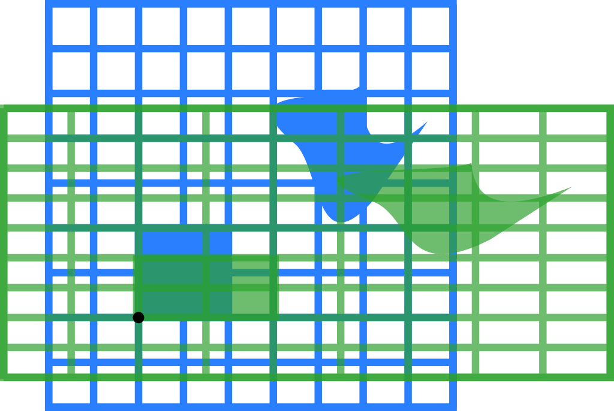

# Transformacije

Transformacije obuhvataju kretanje objekata (napred, nazad, gore, dole), skaliranje (uvećanje ili smanjenje) i rotiranje.


## Linearna transformacija


Linearna transformacija vrši se tako što se transformaciona matrica pomnoži sa izvornom matricom.

What makes a transformation linear is the following geometric rule: The origin must remain fixed, and all lines must remain lines.

### Identitet

Jedinična (ili identična) matrica je kvadratna matrica kojoj su elementi na glavnoj dijagonali jedinice, a ostali nule. Ona u množenju ne menja druge matrice (slično kao broj 1).

Za 2D:
```
[ 1 0
  0 1 ]
```

Za 3D:
```
[ 1 0 0
  0 1 0
  0 0 1 ]
```

I tako dalje do N dimenzija...

### Preslikavanja (refleksija)

Reflection through the vertical axis:
```
[ -1 0
   0 1  ]
```


### Stretching

Transformation matrix associated with a stretch by a factor `k` along the x-axis:

```
[ k 0
  0 1 ]
```

Similarly, transformation matrix associated with a stretch by a factor `k` along the y-axis:
```
[ 1 0
  0 k ]
```

### Skaliranje

Scaling by a factor of 3/2:
```
[ 3/2  0
   0  3/2 ]
```


### Stiskanje (*squeeze*)

Squeeze mapping with r=3/2:
```
[ 3/2  0
   0  2/3 ]
```


### Rotation
Transformation matrix for a rotation counter-clockwise about the origin:
```
[  cos(θ) sin(θ)
  -sin(θ) cos(θ) ]
```

Rotation by π/6 (30°):


### Striganje (*shearing*)

Striganje ili striž paralelan x osi:
```
[ 1 k
  0 1 ]
```

A shear parallel to the y axis:
```
[ 1 0
  k 1 ]
```

Horizontal (ili vertikal) shear sa k = 1.5:
```
[ 1 1.5
  0 1  ]
```


### Obrtanje (inverzija)

Ako je matrica A:
```
[ a b
  c d  ]
```

Njena inverzija je:


(`a * d - b * c` se naziva determinanta matrice)

## 3D Matrices

Matrices in 3D work just like they do in 2D. You just define three columns for the basis vectors instead of two. If the basis vectors are (a,b,c), (d,e,f) and (g,h,i) then your matrix should be:

[a d g
 b e h
 c f i]


http://alfonse.bitbucket.org/oldtut/Positioning/Tut04%20The%20Matrix%20Has%20You.html
https://developer.mozilla.org/en-US/docs/Web/API/WebGL_API/Matrix_math_for_the_web
https://www.tutorialspoint.com/computer_graphics/3d_transformation.htm