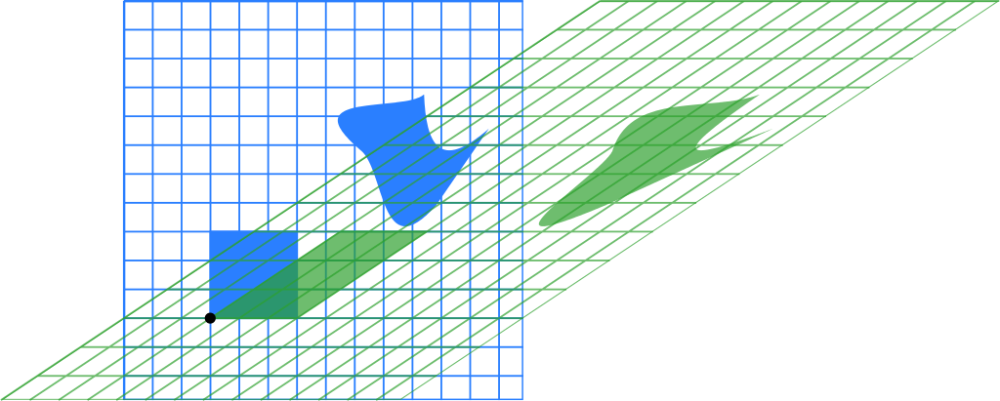
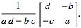

# 2D linearne transformacije

Linearno preslikavanje (ili linearna transformacija) je funkcija između dva vektorska prostora. 

Linearne transformacija obuhvataju kretanje objekata (napred, nazad, gore, dole), skaliranje (uvećanje ili smanjenje) i rotiranje. Transformacija se mogu predstaviti kao matrice.


Linearna transformacija funkcioniše tako što se transformaciona matrica pomnoži sa izvornom matricom. Transformaciju linearnom čini sledeće pravilo: ishodište ostaje fiksno a sve linije ostaju prave.

## Identitet

Identitetska (ili jedinična) matrica je kvadratna matrica kojoj su brojevi na glavnoj dijagonali jedinice, a ostalo nule. Ona u množenju ne menja druge matrice, slično kao broj 1.

2D identitetska matrica:
```
1 0
0 1
```

3D identitetska matrica:
```
1 0 0
0 1 0
0 0 1
```

I tako dalje...

## Refleksija (preslikavanje)

Refleksija kroz vertikalnu osu:

```
-1 0
 0 1
```


## Istezanje (*stretching*)

Transformaciona matrica za istezanje faktorom `k` duž x ose:

```
k 0
0 1
```

Slično, transformaciona matrica za istezanje faktorom `k` duž y ose:

```
1 0
0 k
```

## Skaliranje

Skaliranje faktorom 3/2:

```
3/2  0
 0  3/2
```


## Stiskanje (*squeeze*)

Mapiranje stiskanja sa r=3/2:

```
3/2  0
 0  2/3
```


## Rotacija

Transformaciona matrica za rotaciju oko ishodišta u smeru suprotnom od kazaljke:

```
 cos(θ) sin(θ)
-sin(θ) cos(θ)
```

Rotacija za π/6 (30°):


## Striganje (*shearing*)

Striganje paralelno x osi:

```
1 k
0 1
```

Striganje paralelno y osi:

```
1 0
k 1
```

Horizontalno (ili vertikalno?) striganje sa k = 1.5:

```
1 1.5
0 1
```




## Obrtanje (inverzija)

Ako je matrica A:

```
a b
c d
```

Njena inverzija je:



`a * d - b * c` se naziva determinanta matrice.
