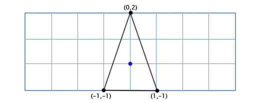
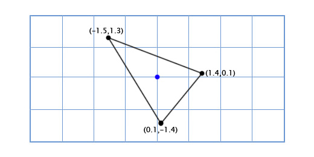
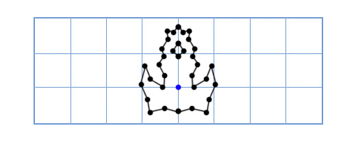
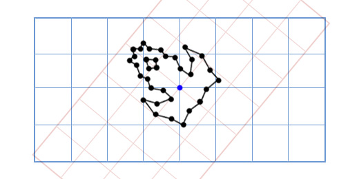

# Rotacija (vrtnja)

In two dimensions, it’s quite easy to express the orientation of a rigid body. Since there is only one possible axis of rotation, the only information we need is the angle.

In three dimensions, however, there are three primary coordinate axes about each of which a body may rotate. Moreover, a body in three dimensions may rotate about any arbitrary axis, not necessarily one of the coordinate axes.

## Tarzan

For example, the player can jump on to a rope and swing from one platform to another. You can implement the swinging motion as a rotation around the point where the rope is attached. In order to do this, you need to calculate the vector going from the player to the center of rotation, take the ugao of this vector, increase it a bit, and recalculate the player's position.

You have to calculate the ugao of the vector from the player to the center of rotation with atan2(). After you have increased the ugao, you can calculate the new x- and y-coordinates with sin and cos:

```c
ugao = atan2 (y, x);
duzina = sqrt (x * x + y * y);
ugao += 1;
nov_x = duzina * cos (ugao);
nov_y = duzina * sin (ugao);
```

Because you convert from Cartesian coordinates to polar coordinates and then back again, you can lose precision. There is a better way: you can make use of a rotation matrix. Rotation matrices provide a way to rotate a vector without converting to polar coordinates:

```
nov_x = x * cos (ugao) - y * sin (ugao)
nov_y = x * sin (ugao) + y * cos (ugao)
```

With this method, you can perform rotations without using atan2. It is sensible to precalculate cos and sin, since you need it twice.

## Posebni slučajevi

I kod rotacije za 90 stepeni možemo koristiti istu formulu:
```
nov_x = x * cos (90) - y * sin (90)
nov_y = x * sin (90) + y * cos (90)
```

Ali cos(90) je 0, a sin(90) je 1, pa možemo uprostiti:
```
nov_x = x * 0 - y * 1
nov_y = x * 1 + y * 0

nov_x = -y
nov_y = x
```

Rotacija za 180 stepeni se svodi na:
```
nov_x = -x
nov_y = -y
```

Ovde su svi specijalni slučajevi, tj. četvrtine kruga:

| stepeni | 90 | 180 | 270 | 360 |
| ------- |:--:| :--:|:---:|----:|
| x       | -y | -x  | y   | x   |
| y       | x  | -y  | -x  | y   |

## Brodić

Let's say we're making an Asteroids game, and we have a simple 2D space ship that can rotate freely. The ship model looks like this:



So how do we draw it when the player rotates by an arbitrary amount, like 49 degrees counter-clockwise? Well, trigonometry we can create a function for 2D rotation that inputs a point and an angle, and outputs a rotated point:

```java
vec2 rotate(vec2 point, float angle){
   vec2 rotated_point;
   rotated_point.x = point.x * cos(angle) - point.y * sin(angle);
   rotated_point.y = point.x * sin(angle) + point.y * cos(angle);
   return rotated_point;
}
```

Applying this to our three points gives us the following shape:



Cosine and sine operations are pretty slow, but we're only doing them on three points. But now we decide to upgrade the ship to look like this:



Now our old method is too slow! There are many ways to solve this problem, but an elegant solution comes to us like this: "What if instead of rotating each point in the model, we just rotate the model's x and y axes instead?"



How does this work? Well, let's look at what coordinates mean. When we talk about the point (3,2), we are saying that its position is three times the x-axis plus two times the y-axis. The default axes are (1,0) for the x-axis and (0,1) for the y-axis, so we get the position 3(1,0) + 2(0,1). But the axes don't have to be (1,0) and (0,1). If we rotate these axes, then we can rotate every point at the same time.

To get the rotated x and y axes we just use the trigonometric function above. For example, if we are rotating by 49 degrees, then we get the new x-axis by rotating (1,0) by 49 degrees and we get the y-axis by rotating (0,1) by 49 degrees. Our new x-axis is (0.66, 0.75), and our new y-axis is (-0.75, 0.66).

Whenever you have modified the basis vectors (1,0) and (0,1) to (a,b) and (c,d), then the modified point (x,y) can be found using this expression:
```
x(a,b) + y(c,d)
```

Rotate function is more elegantly expressed in matrix form:

```
[cos(θ) -sin(θ)
 sin(θ)  cos(θ)]
```

## 3D rotacija

Rotation about the Z axis works just like in 2D. We just have to add an extra column and row:

[cos(θ) -sin(θ) 0
 sin(θ)  cos(θ) 0
 0       0      1]

By default, the rotation matrix rotates objects with respect to the origin, just like the scaling matrix does. The resulting effect is that the object appears to be orbiting about the origin.

There are actually two different approaches to rotating 3D objects. One method uses quaternions, but the math is complex. This second method is Euler rotation. It is very similar to scaling and translating.

## Euler angles

The three Euler angles (roll, pitch, and yaw) represent the orientation of a rigid body in 3D. For example, in an airplane the nose pitches up or down, the plane rolls (or banks) left or right, and the yaw (or heading) changes to the left or right.

http://ogldev.atspace.co.uk/www/tutorial07/tutorial07.html
http://alfonse.bitbucket.org/oldtut/Positioning/Tut06%20Rotation.html
http://blog.wolfire.com/2010/07/Linear-algebra-for-game-developers-part-4
