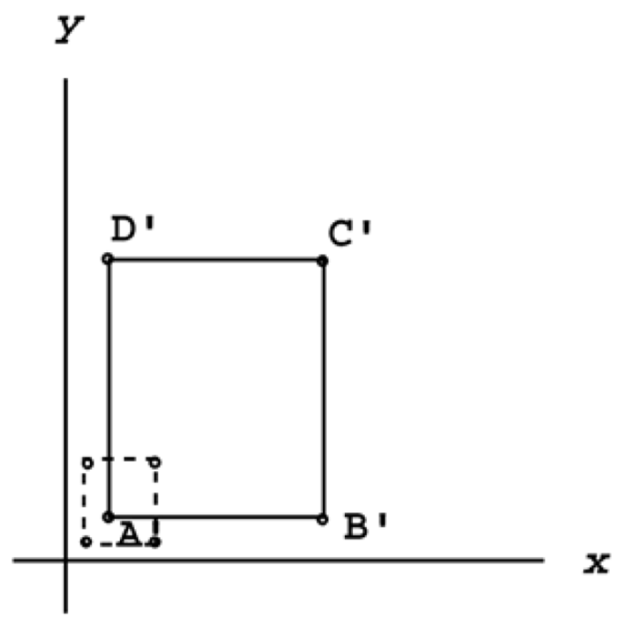

## Skaliranje

The process is the same as translation: Plug in each vertex one at a time, and multiply the matrices to find its new location. If you want to perform a uniform (proportional) scale, just make sure that Sx = Sy. If you plug in two different values for Sx and Sy, you'll end up with a differential scale.

The scaling process works the exact same way in 3D.

