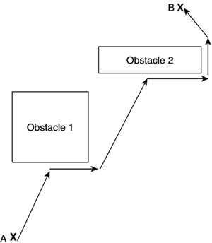
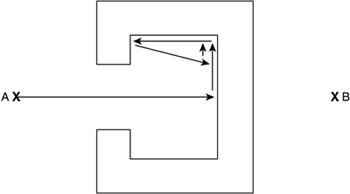

# Traženje putanje

Traženje putanje je pronalazak najkraće putanje između dve tačke. Često se primenjuje za rešavanje lavirinata.

U suštini, metod traženja putanje traži graf počevši od jednog čvora i nastavlja pretraživanje na susedne čvorove dok se ne pronađe ciljni čvor, sa nameom da se pronađe najkraći put.

Path finding algorithms can be divided in two broad categories: local and global. Local approaches try to find a path to a destination by analyzing the surroundings of the current position only. We know in which direction we want to go, and we try to perform the best move by studying our local neighborhood. Global algorithms, on the other hand, analyze the area as a whole and trace the best path using all the information.

## Crash and Turn

This is a local method that quite closely resembles what a simple animal would try to do. Let's start at point A and try to find a way to point B. Logically, we would try to move in a straight line as long as we can. Once we reach an obstacle, we would choose one of the two sides (left or right) and try to go around it, follow the object parallel to its sides until we have open line of sight of the destination again, and thus can return to the straight line of advance.

The algorithm can thus be formalized as follows:

```
while we have not reached our destination
   if we can advance in a straight line to the destination point, do so
   else
      select one direction (left or right) using one of several heuristics
      advance in the said direction keeping your left/right hand touching the obstacle's
wall
      when you can advance in a straight line towards the target again, do so
     end if
end while
```



All we need is to decide which side it will use to go around the obstacle. Two possibilities are:
* Choosing the side that deviates less from the initial trajectory
* Choosing a random side (sounds crazy, but works surprisingly well)

The algorithm is quite lightweight and thus can be implemented with very low CPU impact. But, the algorithm has some problems dealing with concave obstacles. We will get stuck in C-shaped areas in an infinite loop, because we won't be able get around the obstacle once we get inside.



## Dajkstrin algoritam

Pseudokod:

```java
1  function Dijkstra(Graph, source):
2
3      create vertex set Q
4
5      for each vertex v in Graph:             // Initialization
6          dist[v] ← INFINITY                  // Unknown distance from source to v
7          prev[v] ← UNDEFINED                 // Previous node in optimal path from source
8          add v to Q                          // All nodes initially in Q (unvisited nodes)
9
10      dist[source] ← 0                        // Distance from source to source
11      
12      while Q is not empty:
13          u ← vertex in Q with min dist[u]    // Source node will be selected first
14          remove u from Q
15          
16          for each neighbor v of u:           // where v is still in Q.
17              alt ← dist[u] + length(u, v)
18              if alt < dist[v]:               // A shorter path to v has been found
19                  dist[v] ← alt
20                  prev[v] ← u
21
22      return dist[], prev[]
```

Dajkstrin algoritam u C++:

```c++
struct edge { int to, length; };

int dijkstra(const vector< vector<edge> > &graph, int source, int target) {
    vector<int> min_distance( graph.size(), INT_MAX );
    min_distance[ source ] = 0;
    set< pair<int,int> > active_vertices;
    active_vertices.insert( {0,source} );

    while (!active_vertices.empty()) {
        int where = active_vertices.begin()->second;
        if (where == target) return min_distance[where];
        active_vertices.erase( active_vertices.begin() );
        for (auto ed : graph[where])
            if (min_distance[ed.to] > min_distance[where] + ed.length) {
                active_vertices.erase( { min_distance[ed.to], ed.to } );
                min_distance[ed.to] = min_distance[where] + ed.length;
                active_vertices.insert( { min_distance[ed.to], ed.to } );
            }
    }
    return INT_MAX;
}
```

## A*

A* (pronounced A-star) is a global space-search algorithm that can be used to find solutions to many problems, path finding being just one of them. It has been used in many real-time strategy games and is probably the most popular path finding algorithm.


Here is the pseudocode:

```java
priorityqueue Open
list Closed
s.g = 0  // s is the start node
s.h = GoalDistEstimate( s )
s.f = s.g + s.h
s.parent = null
push s on Open
while Open is not empty
   pop node n from Open  // n has the lowest f
   if n is a goal node
      construct path
      return success
   for each successor n' of n
      newg = n.g + cost(n,n')
      if n' is in Open or Closed, and n'.g < = newg
         skip
      n'.parent = n
      n'.g = newg
      n'.h = GoalDistEstimate( n' )
      n'.f = n'.g + n'.h
      if n' is in Closed
         remove it from Closed
      if n' is not yet in Open
         push n' on Open
   push n onto Closed
return failure
```

https://gamedevelopment.tutsplus.com/tutorials/a-pathfinding-for-2d-grid-based-platformers-making-a-bot-follow-the-path--cms-24913

https://gamedevelopment.tutsplus.com/tutorials/how-to-adapt-a-pathfinding-to-a-2d-grid-based-platformer-theory--cms-24662

https://gamedevelopment.tutsplus.com/tutorials/how-to-adapt-a-pathfinding-to-a-2d-grid-based-platformer-implementation--cms-24679
