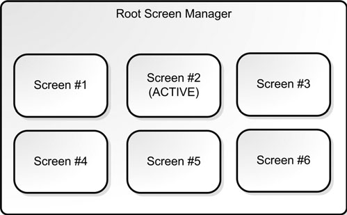

# Screens Transition Management

If your game has multiple screens, and even simple games have many, it’s wise
to manage them and the transitions between them in a high-level API. It’s a little like
programming multiple applications for the same window, and you can freely
move from one screen to another by selecting the right controls.

Other games use multiple screens to set up the characters or missions.

If your screens are fairly small “memory-wise,” consider preloading them. Or you might consider loading a small transition screen to give your players something to look at while you load your bigger screens.



```c++
class IScreenElement
{
  public:
  virtual HRESULT VOnRestore() = 0;
  virtual HRESULT VOnRender(double fTime, float fElapsedTime) = 0;
  virtual void VOnUpdate(int deltaMilliseconds) = 0;
  virtual int VGetZOrder() const = 0;
  virtual void VSetZOrder(int const zOrder) = 0;
  virtual bool VIsVisible() const = 0;
  virtual void VSetVisible(bool visible) = 0;
  virtual LRESULT CALLBACK VOnMsgProc( AppMsg msg )=0;
  virtual  ̃ IScreenElement() { };
  virtual bool const operator <(IScreenElement const &other)
  { return VGetZOrder() < other.VGetZOrder(); }
};
```
