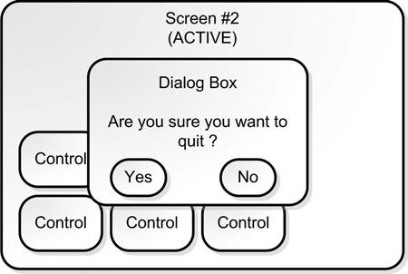
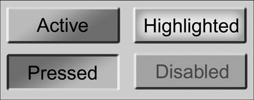

## User Interface

There are a few random but important tips on user interface:

* All rectangular interfaces are boring.
* Localization can make a mess of UI (mnogo duže reči i slično).
* UI code is easy to write, but making a good UI is an art form.

### Modal Dialog Boxes

Modal dialog boxes usually present the player with a question, such as “Do you really want to quit?”

### Kontrole

Controls have four states: active, highlighted, pressed, and disabled.

When the player presses a button on the mouse or controller, the control state changes from active to pressed.
